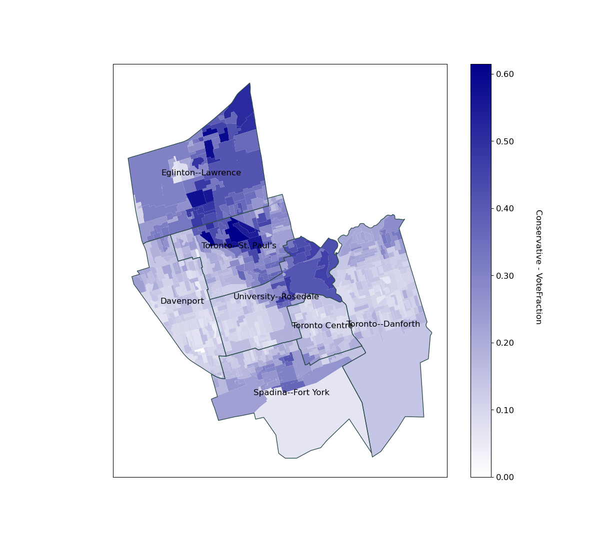
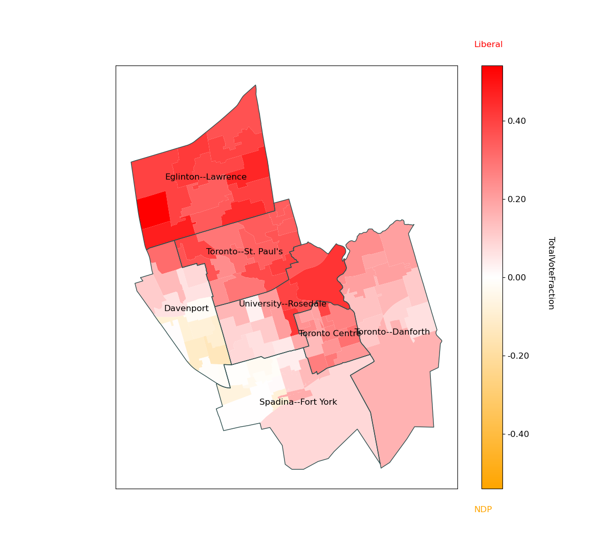
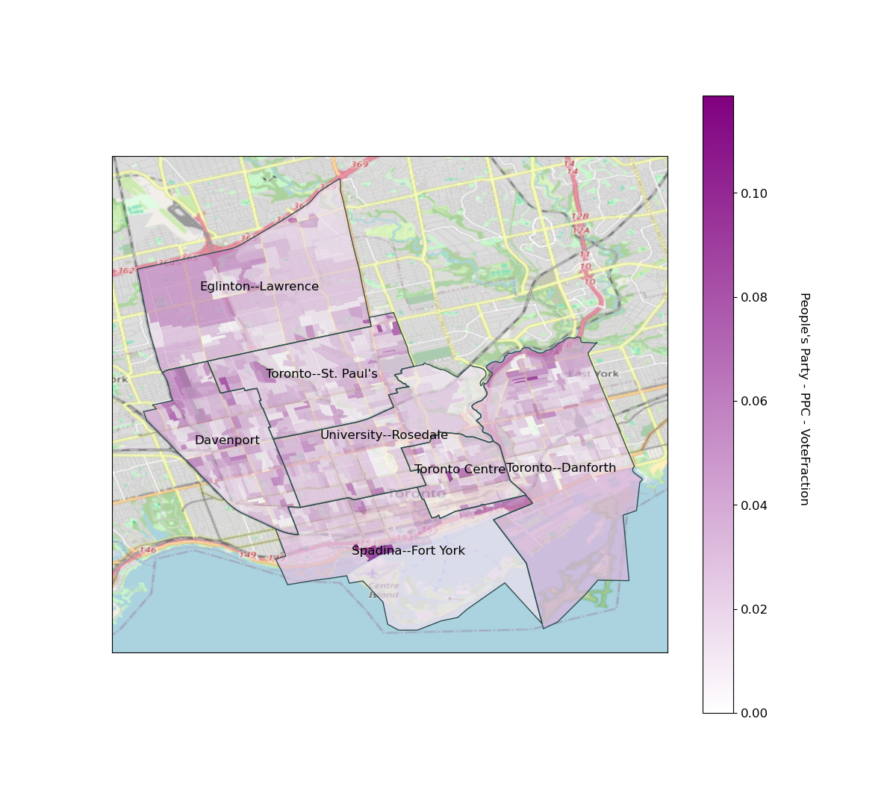
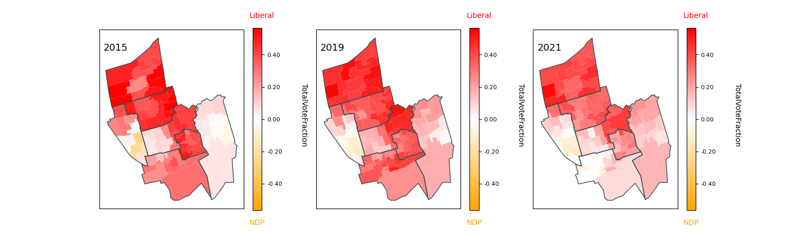
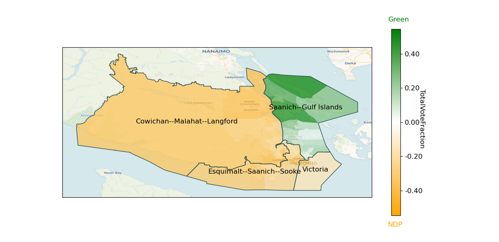

# Mapping Recent Canadian Federal Elections
- by Mark Fruman mark.fruman@yahoo.com

## Fetch geometry and vote results data
- Data available for general elections of 2008, 2011, 2015, 2019, 2021
- Note that some riding names and shapes change from election to election
  so separate geometry files are needed for each election

```python
import canadavotes as cdv

# download vote data for 2021
cdv.get_all_vote_data(year=2021)

# download geometry files for election-day poll boundaries
cdv.get_geometries(year=2021)

# generate province-specific geometry files (for speed and memory efficiency)
cdv.generate_provincial_geometries(year=2021)
```
## Basic usage

```python
import canadavotes as cdv

# instantiate a CanadaVotes object with a list of ridings or predefined area
toronto = cdv.CanadaVotes(area="downtown_toronto", years=[2015, 2019, 2021])

# some predefined areas:
#   "downtown_toronto", "north_toronto",
#   "scarborough", "etobicoke", "mississauga",
#   "vaughan", "brampton",
#   "milton", "hamilton", "cottage_country",
#   "london", "kitchener_waterloo", "ottawa",
#   "calgary", "winnipeg", "montreal", "quebec",
#   "pei"

toronto
```

```output
CanadaVotes object
Years: 2015 2019 2021
Ridings:
	University--Rosedale
	Spadina--Fort York
	Toronto Centre
	Davenport
	Toronto--St. Paul's
	Toronto--Danforth
```

```python
# load all data for the specified ridings and years
toronto.load()
```
```output
Loading year 2015 . . . loaded.
Loading year 2019 . . . loaded.
Loading year 2021 . . . loaded.
CanadaVotes object
Years: 2015 2019 2021
Ridings:
	University--Rosedale
	Spadina--Fort York
	Toronto Centre
	Davenport
	Toronto--St. Paul's
	Toronto--Danforth
```

```python
# add a riding and load again (i.e. update data)
toronto.add_riding("Eglinton--Lawrence").load()
```

#### Some simple vote analysis
```python
# total votes across all ridings in area by party
toronto.votes(by="Party", year=2021)
```
| Party                    |   Votes |   VoteFraction |
|:-------------------------|--------:|---------------:|
| Liberal                  |  160137 |     0.464662   |
| NDP-New Democratic Party |   91652 |     0.265942   |
| Conservative             |   67909 |     0.197048   |
| Green Party              |   14354 |     0.041650   |
| People's Party - PPC     |    9353 |     0.027139   |
| Communist                |     640 |     0.001857   |
| Animal Protection Party  |     300 |     0.000870   |
| Independent              |     123 |     0.000357   |
| Independent-02           |      86 |     0.000250   |
| Independent-01           |      77 |     0.000223   |

```python
# total votes by individual candidate, sorted by vote fraction
toronto.votes(by="Candidate", key="VoteFraction", year=2021)
```
| Candidate                     | Party                    | DistrictName         |   Votes |   VoteFraction |
|:------------------------------|:-------------------------|:---------------------|--------:|---------------:|
| Bennett, Carolyn  (Elected)   | Liberal                  | Toronto--St. Paul's  |   26429 |     0.492178   |
| Dabrusin, Julie  (Elected)    | Liberal                  | Toronto--Danforth    |   25214 |     0.483564   |
| Mendicino, Marco  (Elected)   | Liberal                  | Eglinton--Lawrence   |   24051 |     0.484792   |
| Ien, Marci  (Elected)         | Liberal                  | Toronto Centre       |   23071 |     0.503547   |
| Freeland, Chrystia  (Elected) | Liberal                  | University--Rosedale |   22451 |     0.475304   |
| Dzerowicz, Julie  (Elected)   | Liberal                  | Davenport            |   19930 |     0.421291   |
| Bravo, Alejandra              | NDP-New Democratic Party | Davenport            |   19854 |     0.419684   |
| Vuong, Kevin  (Elected)       | Liberal                  | Spadina--Fort York   |   18991 |     0.388992   |
| Pollock, Geoff                | Conservative             | Eglinton--Lawrence   |   18082 |     0.364476   |
| Hacksel, Clare                | NDP-New Democratic Party | Toronto--Danforth    |   17555 |     0.336677   |
| Di Pasquale, Norm             | NDP-New Democratic Party | Spadina--Fort York   |   16834 |     0.344811   |
| Osadchuk, Stephanie           | Conservative             | Toronto--St. Paul's  |   13587 |     0.253026   |
| Robicheau, Nicole             | NDP-New Democratic Party | University--Rosedale |   11921 |     0.252376   |
| Chang, Brian                  | NDP-New Democratic Party | Toronto Centre       |   11909 |     0.259925   |
| Jandu, Sukhi                  | Conservative             | Spadina--Fort York   |    9875 |     0.20227    |
| Taylor, Steven                | Conservative             | University--Rosedale |    9473 |     0.20055    |
| Coles, Sidney                 | NDP-New Democratic Party | Toronto--St. Paul's  |    9036 |     0.168274   |
| Carey, Michael                | Conservative             | Toronto--Danforth    |    6547 |     0.125561   |
| Lester, Ryan                  | Conservative             | Toronto Centre       |    5571 |     0.121592   |
| Kalimbet, Jenny               | Conservative             | Davenport            |    4774 |     0.100915   |
| Senneker, Caleb               | NDP-New Democratic Party | Eglinton--Lawrence   |    4543 |     0.0915724  |
| Paul, Annamie                 | Green Party              | Toronto Centre       |    3921 |     0.0855796  |
| De Luna, Phil                 | Green Party              | Toronto--St. Paul's  |    3214 |     0.0598533  |
| Grant, Tim                    | Green Party              | University--Rosedale |    1974 |     0.041791   |
| Rosenstock, Amanda            | Green Party              | Spadina--Fort York   |    1645 |     0.0336945  |
| Dos Remedios, Tara            | People's Party - PPC     | Davenport            |    1499 |     0.0316866  |
| Frydman, Eric                 | Green Party              | Eglinton--Lawrence   |    1490 |     0.0300337  |
| Roden, Ian                    | People's Party - PPC     | Spadina--Fort York   |    1476 |     0.0302329  |
| Gleeson, Timothy              | People's Party - PPC     | Eglinton--Lawrence   |    1445 |     0.0291266  |
| Remedios, Peter               | People's Party - PPC     | Toronto--St. Paul's  |    1432 |     0.0266677  |
| Simmons, Wayne                | People's Party - PPC     | Toronto--Danforth    |    1282 |     0.0245867  |
| Kent, David                   | People's Party - PPC     | University--Rosedale |    1172 |     0.0248121  |
| Currie, Adrian                | Green Party              | Davenport            |    1087 |     0.0229776  |
| Jaffery, Syed                 | People's Party - PPC     | Toronto Centre       |    1047 |     0.0228518  |
| Tollar, Maryem                | Green Party              | Toronto--Danforth    |    1023 |     0.0196195  |
| Garvie, Drew                  | Communist                | University--Rosedale |     244 |     0.00516566 |
| Rowley, Elizabeth             | Communist                | Toronto--Danforth    |     215 |     0.00412336 |
| White, Liz                    | Animal Protection Party  | Toronto--Danforth    |     183 |     0.00350965 |
| Byard, Ivan                   | Communist                | Toronto Centre       |     181 |     0.0039505  |
| Desai, Habiba                 | Independent              | Toronto--Danforth    |     123 |     0.00235894 |
| Stubbins, Peter               | Animal Protection Party  | Toronto Centre       |     117 |     0.00255364 |
| Young, Troy                   | Independent-02           | Davenport            |      86 |     0.00181791 |
| Kalevar, Chai                 | Independent-01           | Davenport            |      77 |     0.00162767 |

#### Plot vote results
```python
# plot Conservative Party of Canada vote fraction by election-day poll station
toronto.plot_votes(party="Conservative", advance=False, year=2021,
                   plot_variable="VoteFraction")
```


```python
# compare Liberal and NDP vote fraction by advance poll (include election day votes)
toronto.plot_compare(party1="Liberal", party2="NDP-New Democratic Party", year=2021,
                     advance=True, plot_variable="TotalVoteFraction")
```


#### Add a basemap background to the figure
```python
# People's Party vote share with a Mapnik background
toronto.plot_votes(party="People's Party - PPC", advance=False,
                   plot_variable="VoteFraction", year=2021,
                   basemap="Mapnik", figwidth=12)
```


#### Compare results over multiple elections
```python
# compare results over three elections
toronto.plot_multiyear(comparison=True, years=[2015, 2019, 2021],
                       party1="Liberal", party2="NDP-New Democratic Party", 
                       advance=True, plot_variable="TotalVoteFraction",
                       figwidth=19, ridings_args={"labels": False})
```


#### Find ridings by proximity
```python
# query riding by regex pattern
cdv.query_ridings(".*Vic", year=2021)
```
```output
['Sydney--Victoria', 'Victoria']
```
```python
# new CanadaVotes object based on four ridings nearest to "Victoria"
victoria = cdv.CanadaVotes(ridings=cdv.get_nearest_ridings("Victoria", 
                                                           year=2021, n=4),
                           years=2021)
victoria.load()
```
```output
Loading year 2021 . . . loaded.

CanadaVotes object
Years: 2021
Ridings:
	Victoria
	Esquimalt--Saanich--Sooke
	Saanich--Gulf Islands
	Cowichan--Malahat--Langford
```
```python
# plot Green Party vs. NDP share over "Voyager" basemap
victoria.plot_compare(party1="Green Party", party2="NDP-New Democratic Party", year=2021,
                      advance=True, plot_variable="TotalVoteFraction", basemap="Voyager",
                      figwidth=14)
```


## References:
#### Maps of current electoral districts
- https://www.elections.ca/content.aspx?section=res&dir=cir/maps2&document=index&lang=e

#### Shape-file data for polling station boundaries (2021)
- Documentation:<BR> https://ftp.maps.canada.ca/pub/elections_elections/Electoral-districts_Circonscription-electorale/Elections_Canada_2021/Elections_Canada_2021_Data_Dictionary.pdf
- Election-day polling stations (2021):<BR>https://open.canada.ca/data/en/dataset/0ed37cd6-d831-4183-bf43-b05e29570298

#### Results for 2021 Canadian federal election
- https://elections.ca/content.aspx?section=res&dir=rep/off/44gedata&document=bypro&lang=e

#### List of riding names and numbers
- https://elections.ca/content.aspx?section=res&dir=rep/off/44gedata&document=byed&lang=e