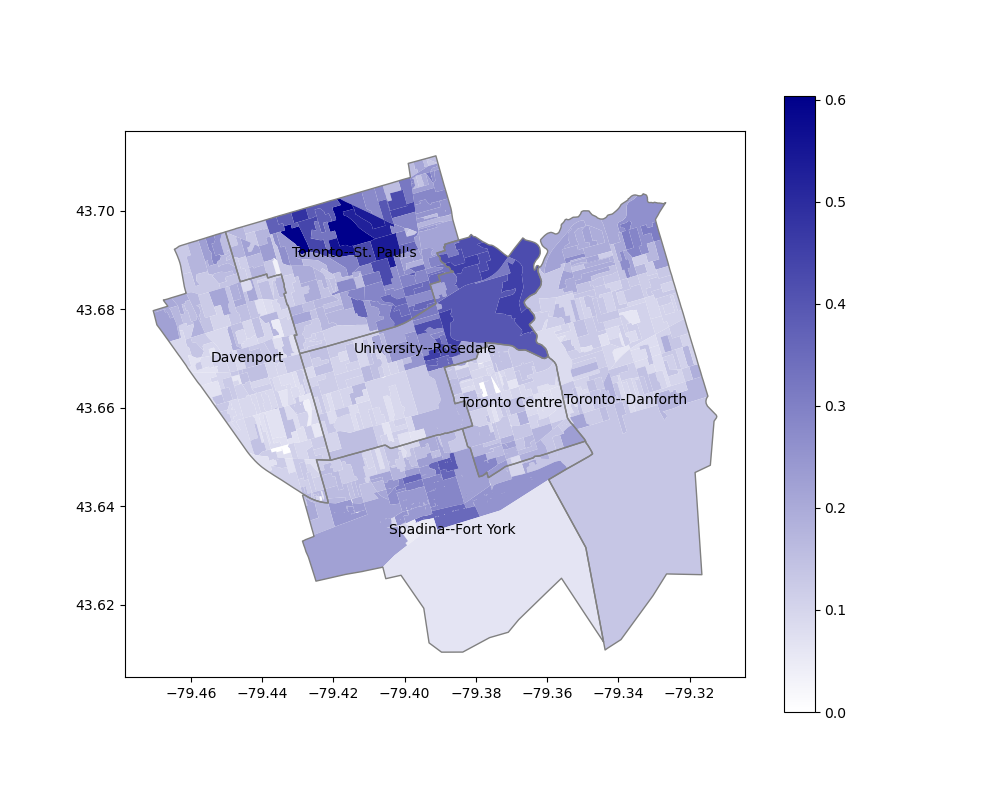
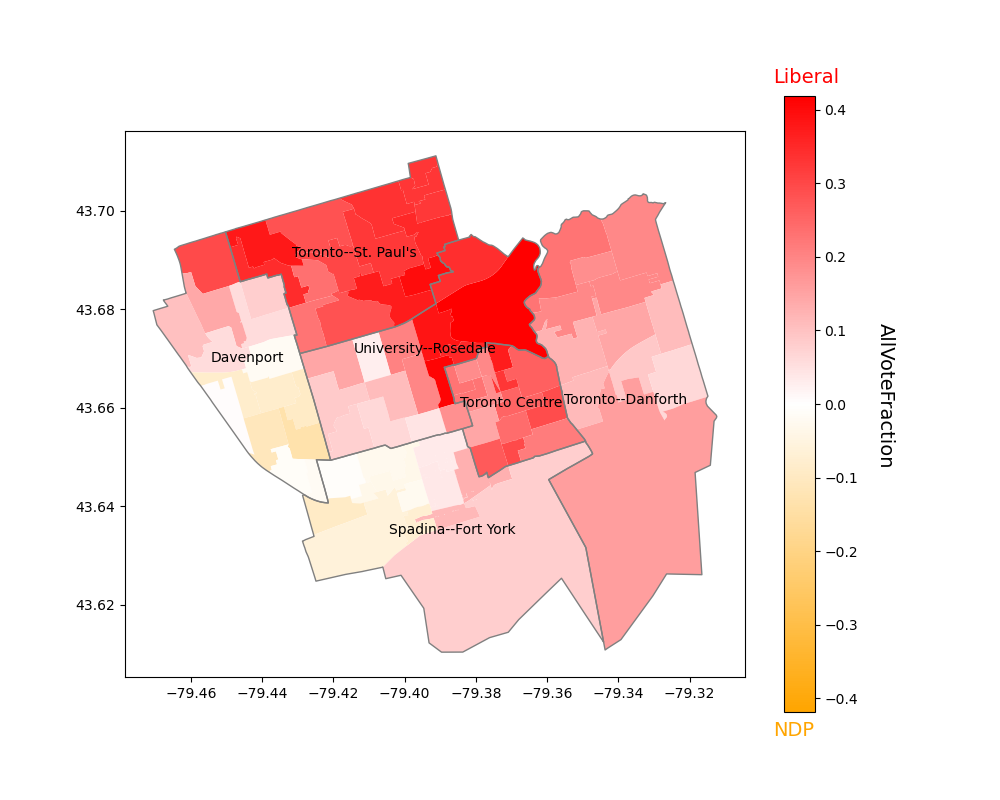
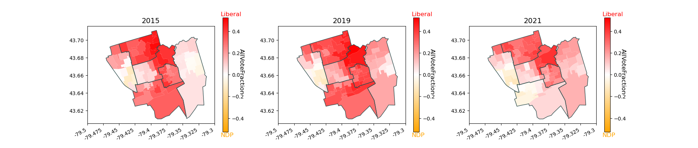
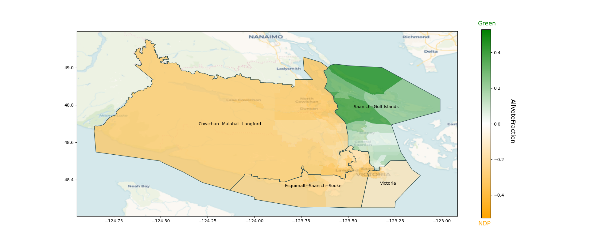

# Mapping Recent Canadian Federal Elections
- by Mark Fruman mark.fruman@yahoo.com

## Fetch geometry and vote results data
- Data available for general elections of 2008, 2011, 2015, 2019, 2021
- Note that some riding names and shapes change from election to election
  so separate geometry files are needed for each election

```python
import canadavotes as cdv

# download vote data for 2021
cdv.get_all_vote_data(year=2021)

# download geometry files for election-day poll boundaries
cdv.get_geometries(year=2021)

# generate province-specific geometry files (for speed and memory efficiency)
cdv.generate_provincial_geometries(year=2021)
```
## Basic usage

```python
import canadavotes as cdv

# instantiate a CanadaVotes object with a list of ridings or predefined area
toronto = cdv.CanadaVotes(area="downtown_toronto", years=[2015, 2019, 2021])

# some predefined areas:
#   "downtown_toronto", "north_toronto",
#   "scarborough", "etobicoke", "mississauga",
#   "vaughan", "brampton",
#   "milton", "hamilton", "cottage_country",
#   "london", "kitchener_waterloo", "ottawa",
#   "calgary", "winnipeg", "montreal", "quebec",
#   "pei"

toronto
```

```output
CanadaVotes object
Years: 2015 2019 2021
Ridings:
	University--Rosedale
	Spadina--Fort York
	Toronto Centre
	Davenport
	Toronto--St. Paul's
	Toronto--Danforth
Election 2015 parties:
	not loaded
Election 2019 parties:
	not loaded
Election 2021 parties:
	not loaded
```

```python
# load all data for the specified ridings and years
toronto.load()
```
```output
Loading year 2015 . . . loaded.
Loading year 2019 . . . loaded.
Loading year 2021 . . . loaded.
CanadaVotes object
Years: 2015 2019 2021
Ridings:
	University--Rosedale
	Spadina--Fort York
	Toronto Centre
	Davenport
	Toronto--St. Paul's
	Toronto--Danforth
Election 2015 parties:
	Animal Alliance/Environment Voters
	Communist
	Conservative
	Green Party
	Independent
	Liberal
	Libertarian
	Marxist-Leninist
	NDP-New Democratic Party
	PACT
	PC Party
	The Bridge
Election 2019 parties:
	Animal Protection Party
	Communist
	Conservative
	Green Party
	Independent
	Liberal
	ML
	NDP-New Democratic Party
	Parti Rhinocéros Party
	People's Party
	Stop Climate Change
Election 2021 parties:
	Animal Protection Party
	Communist
	Conservative
	Green Party
	Independent
	Liberal
	NDP-New Democratic Party
	People's Party - PPC
```

```python
# add a riding and load again (i.e. update data)
toronto.add_riding("Toronto--St. Paul's").load()
```

#### Some simple vote analysis
```python
# total votes across all ridings in area by party
toronto.votes(by="Party", year=2021)
```
| Party                    |   Votes |   TotalVotes |   VoteFraction |
|:-------------------------|--------:|-------------:|---------------:|
| Liberal                  |  120493 |       263894 |     0.456596   |
| NDP-New Democratic Party |   78036 |       263894 |     0.29571    |
| Conservative             |   45151 |       263894 |     0.171095   |
| Green Party              |   11569 |       263894 |     0.0438396  |
| People's Party - PPC     |    7491 |       263894 |     0.0283864  |
| Communist                |     602 |       130472 |     0.00461402 |
| Animal Protection Party  |     281 |        88997 |     0.00315741 |
| Independent              |     271 |       134961 |     0.00200799 |

```python
# total votes by individual candidate
toronto.votes(by="Candidate", year=2021)
```

|    | Candidate                     | Party                    | DistrictName         |   Votes |   TotalVotes |   VoteFraction |
|---:|:------------------------------|:-------------------------|:---------------------|--------:|-------------:|---------------:|
|  0 | Dabrusin, Julie  (Elected)    | Liberal                  | Toronto--Danforth    |   22675 |        46967 |     0.482786   |
|  1 | Bennett, Carolyn  (Elected)   | Liberal                  | Toronto--St. Paul's  |   22270 |        45737 |     0.486914   |
|  2 | Ien, Marci  (Elected)         | Liberal                  | Toronto Centre       |   21122 |        42030 |     0.502546   |
|  3 | Freeland, Chrystia  (Elected) | Liberal                  | University--Rosedale |   19336 |        41475 |     0.466209   |
|  4 | Dzerowicz, Julie  (Elected)   | Liberal                  | Davenport            |   18622 |        43997 |     0.423256   |
|  5 | Bravo, Alejandra              | NDP-New Democratic Party | Davenport            |   18155 |        43997 |     0.412642   |
|  6 | Vuong, Kevin  (Elected)       | Liberal                  | Spadina--Fort York   |   16468 |        43688 |     0.376946   |
|  7 | Hacksel, Clare                | NDP-New Democratic Party | Toronto--Danforth    |   15554 |        46967 |     0.331169   |
|  8 | Di Pasquale, Norm             | NDP-New Democratic Party | Spadina--Fort York   |   15384 |        43688 |     0.352133   |
|  9 | Osadchuk, Stephanie           | Conservative             | Toronto--St. Paul's  |   11871 |        45737 |     0.259549   |
| 10 | Chang, Brian                  | NDP-New Democratic Party | Toronto Centre       |   10901 |        42030 |     0.259362   |
| 11 | Robicheau, Nicole             | NDP-New Democratic Party | University--Rosedale |   10556 |        41475 |     0.254515   |
| 12 | Jandu, Sukhi                  | Conservative             | Spadina--Fort York   |    8993 |        43688 |     0.205846   |
| 13 | Taylor, Steven                | Conservative             | University--Rosedale |    8465 |        41475 |     0.204099   |
| 14 | Coles, Sidney                 | NDP-New Democratic Party | Toronto--St. Paul's  |    7486 |        45737 |     0.163675   |
| 15 | Carey, Michael                | Conservative             | Toronto--Danforth    |    6087 |        46967 |     0.129602   |
| 16 | Lester, Ryan                  | Conservative             | Toronto Centre       |    5146 |        42030 |     0.122436   |
| 17 | Kalimbet, Jenny               | Conservative             | Davenport            |    4589 |        43997 |     0.104303   |
| 18 | Paul, Annamie                 | Green Party              | Toronto Centre       |    3585 |        42030 |     0.0852962  |
| 19 | De Luna, Phil                 | Green Party              | Toronto--St. Paul's  |    2784 |        45737 |     0.0608698  |
| 20 | Grant, Tim                    | Green Party              | University--Rosedale |    1772 |        41475 |     0.0427245  |
| 21 | Rosenstock, Amanda            | Green Party              | Spadina--Fort York   |    1477 |        43688 |     0.0338079  |
| 22 | Dos Remedios, Tara            | People's Party - PPC     | Davenport            |    1457 |        43997 |     0.0331159  |
| 23 | Roden, Ian                    | People's Party - PPC     | Spadina--Fort York   |    1366 |        43688 |     0.0312672  |
| 24 | Remedios, Peter               | People's Party - PPC     | Toronto--St. Paul's  |    1326 |        45737 |     0.0289918  |
| 25 | Simmons, Wayne                | People's Party - PPC     | Toronto--Danforth    |    1227 |        46967 |     0.0261247  |
| 26 | Kent, David                   | People's Party - PPC     | University--Rosedale |    1117 |        41475 |     0.0269319  |
| 27 | Currie, Adrian                | Green Party              | Davenport            |    1022 |        43997 |     0.0232289  |
| 28 | Jaffery, Syed                 | People's Party - PPC     | Toronto Centre       |     998 |        42030 |     0.0237449  |
| 29 | Tollar, Maryem                | Green Party              | Toronto--Danforth    |     929 |        46967 |     0.0197798  |
| 30 | Garvie, Drew                  | Communist                | University--Rosedale |     229 |        41475 |     0.0055214  |
| 31 | Rowley, Elizabeth             | Communist                | Toronto--Danforth    |     201 |        46967 |     0.0042796  |
| 32 | White, Liz                    | Animal Protection Party  | Toronto--Danforth    |     175 |        46967 |     0.00372602 |
| 33 | Byard, Ivan                   | Communist                | Toronto Centre       |     172 |        42030 |     0.00409232 |
| 34 | Desai, Habiba                 | Independent              | Toronto--Danforth    |     119 |        46967 |     0.00253369 |
| 35 | Stubbins, Peter               | Animal Protection Party  | Toronto Centre       |     106 |        42030 |     0.00252201 |
| 36 | Young, Troy                   | Independent              | Davenport            |      82 |        43997 |     0.00186376 |
| 37 | Kalevar, Chai                 | Independent              | Davenport            |      70 |        43997 |     0.00159102 |

#### Plot vote results
```python
# plot Conservative Party of Canada vote fraction by election-day poll station
toronto.plot_votes(party="Conservative", advance=False, year=2021,
                   plot_variable="VoteFraction")
```


```python
# compare Liberal and NDP vote fraction by advance poll (include election day votes)
toronto.plot_compare(party1="Liberal", party2="NDP-New Democratic Party", year=2021,
                     advance=True, plot_variable="AllVoteFraction")
```


#### Add a basemap background to the figure
```python
# People's Party vote share with a Mapnik background
toronto.plot_votes(party="People's Party - PPC", advance=False,
                   plot_variable="VoteFraction", year=2021,
                   basemap="Mapnik", figwidth=12)
```


#### Compare results over multiple elections
```python
# compare results over three elections
toronto.plot_multiyear(comparison=True, years=[2015, 2019, 2021],
                       party1="Liberal", party2="NDP-New Democratic Party", 
                       advance=True, plot_variable="AllVoteFraction",
                       figwidth=19, ridings_args={"labels": False})
```


#### Find ridings by proximity
```python
# query riding by regex pattern
cdv.query_ridings(".*Vic", year=2021)
```
```output
['Sydney--Victoria', 'Victoria']
```
```python
# new CanadaVotes object based on four ridings nearest to "Victoria"
victoria = cdv.CanadaVotes(ridings=cdv.get_nearest_ridings("Victoria", 
                                                           year=2021, n=4),
                           years=2021)
victoria.load()
```
```output
Loading year 2021 . . . loaded.

CanadaVotes object
Years: 2021
Ridings:
	Victoria
	Esquimalt--Saanich--Sooke
	Saanich--Gulf Islands
	Cowichan--Malahat--Langford
Election 2021 parties:
	Animal Protection Party
	Communist
	Conservative
	Green Party
	Liberal
	NDP-New Democratic Party
	People's Party - PPC
```
```python
# plot Green Party vs. NDP share over "Voyager" basemap
victoria.plot_compare(party1="Green Party", party2="NDP-New Democratic Party", year=2021,
                      advance=True, plot_variable="AllVoteFraction", basemap="Voyager",
                      figwidth=14)
```


## References:
#### Maps of current electoral districts
- https://www.elections.ca/content.aspx?section=res&dir=cir/maps2&document=index&lang=e

#### Shape-file data for polling station boundaries (2021)
- Documentation:<BR> https://ftp.maps.canada.ca/pub/elections_elections/Electoral-districts_Circonscription-electorale/Elections_Canada_2021/Elections_Canada_2021_Data_Dictionary.pdf
- Election-day polling stations (2021):<BR>https://open.canada.ca/data/en/dataset/0ed37cd6-d831-4183-bf43-b05e29570298

#### Results for 2021 Canadian federal election
- https://elections.ca/content.aspx?section=res&dir=rep/off/44gedata&document=bypro&lang=e

#### List of riding names and numbers
- https://elections.ca/content.aspx?section=res&dir=rep/off/44gedata&document=byed&lang=e